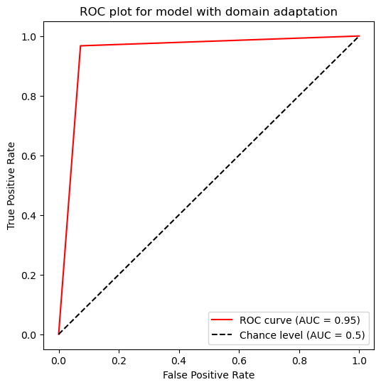

# Test for Search for Strong Gravitational Lenses project Google Summer of Code 2024

**Search for Strong Gravitational Lenses Project Description**

Strong gravitational lensing is a powerful tool in exploring various astrophysical questions, including probing the substructure in dark matter haloes of the lensing galaxies. However one of the main limitations of such analysis is the relatively small number of known lens candidates and confirmed lens systems.

Recent works have shown the potential of CNNs in the task of lens finding — classification of images obtained from the telescopes into lensed and non-lensed systems. Since the number of real lenses is insufficient for training a machine learning algorithm, training datasets heavily rely on simulations. However it has been noticed that CNNs perform worse on lens images obtained with the instrument from the one that simulations were tailored to reproduce (for example, different surveys use different color filters and have different resolution).

The goal of this project is to investigate the prospects of using domain adaptation techniques to bridge the gap between simulated data used for training and real images from different surveys (such as HSC-SSP, HST, DES, JWST, and future missions) and explore which type of lenses has a higher risk of being lost during the automated searches.

This repository contain two tests:
1. Common Test I. Multi-Class Classification
2. Specific Test II. Lens Finding 

The result for common test I is defined `challenge1.ipynb` file and result for specific test II are defined in `challenge2.ipynb` and `challenge2_no_da.ipynb` file. In specific test II, I use two different approach, the first is using domain adaptation technique and the other one is not using domain adaptation. Summary of the final results for both test are:

1. The trained model weight for common test I is in `model_weights_challenge1.pth`. AUC score for this model are: 0.97, 0.95, and 0.97 for lensing images with `no substructure`, `subhalo substructure`, and `vortex substructure` respectively.  
2. The trained model weight for challenge II is in `model_weights_challenge2_with_da.pth` and `model_weights_challenge2_no_da.pth` for model with domain adaptation and without domain adaptation respectively. AUC score are 0.95 for model with domain adaptation and 0.94 for model without domain adaptation. Based on this result, we can conclude that domain adaptation can help to increase the accuracy on validation dataset.

 

